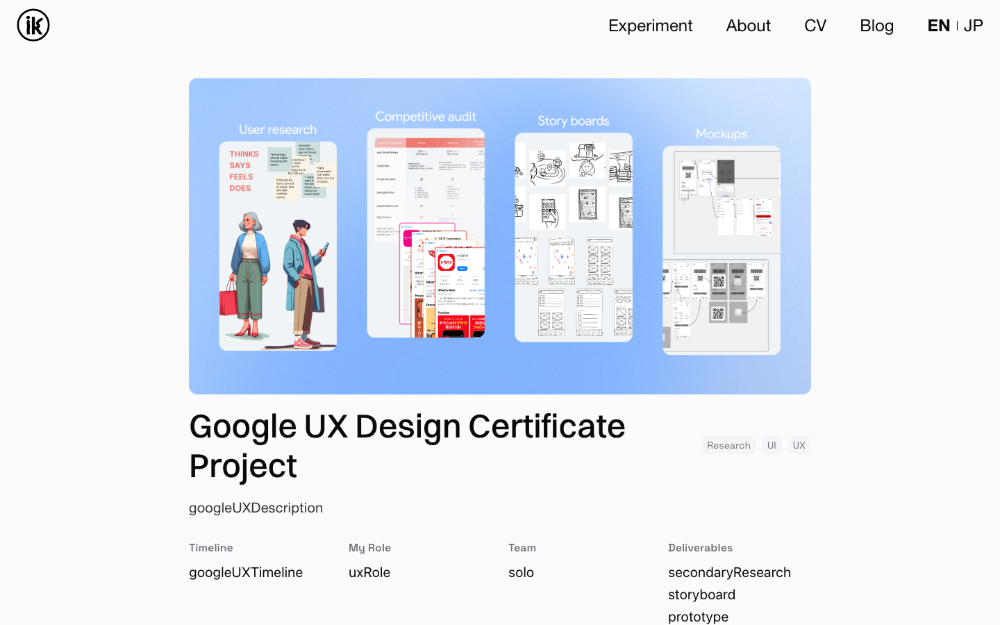
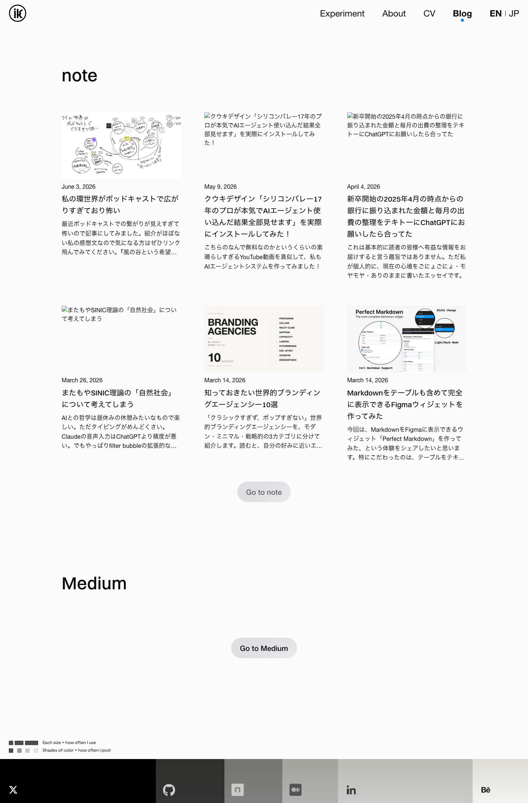
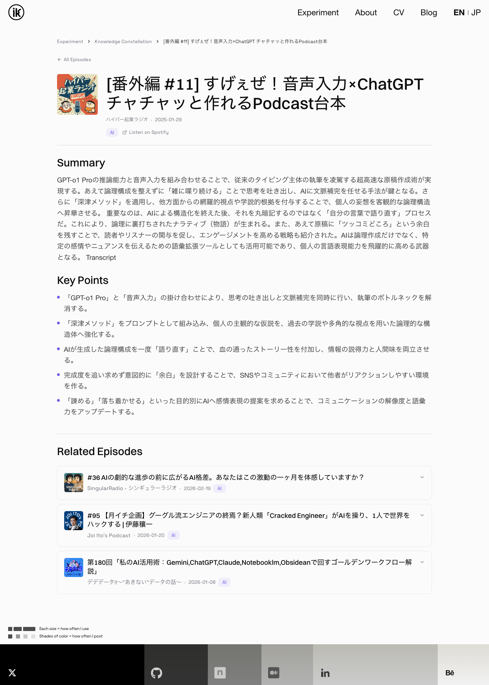
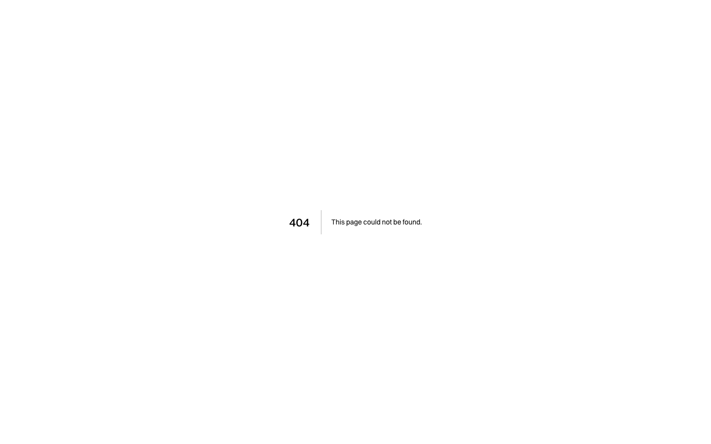
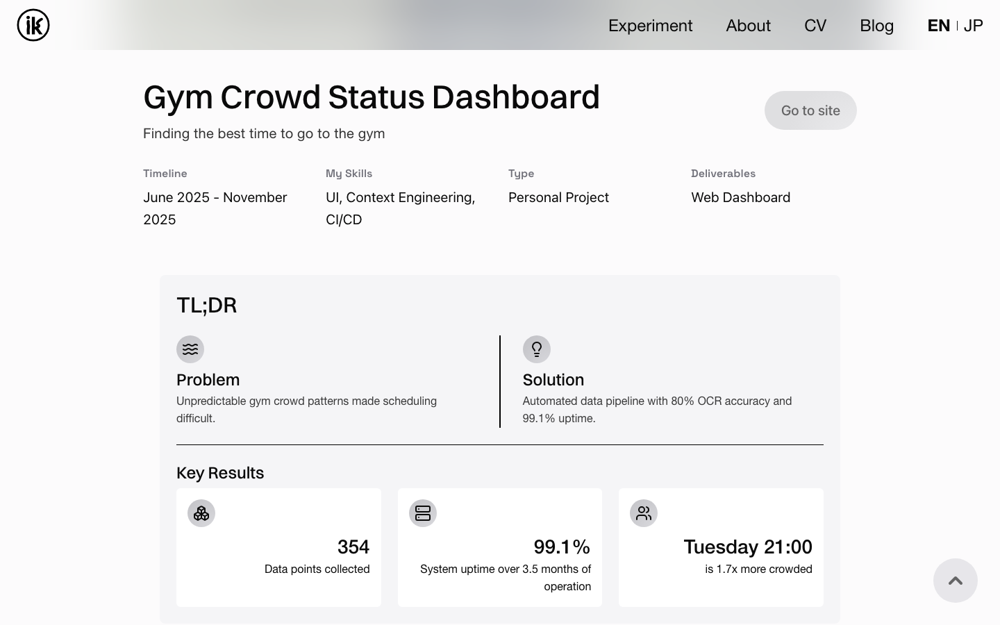
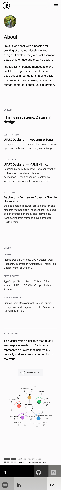
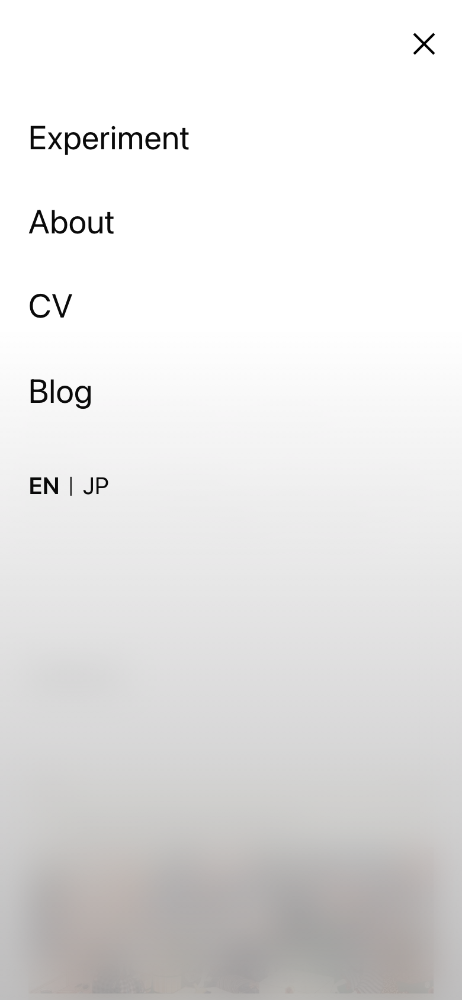

# 本番ポートフォリオ QA レビュー報告

- **対象**: https://iori-kawano.vercel.app
- **実施日**: 2026-07-03
- **範囲**: 全 13 ルート × EN/JP × PC(1440×900) / モバイル(390×844, タッチ) = 52 ビュー + 実操作テスト（ホバー・タップ・メニュー開閉・言語切替・ページ遷移・タブ・スクロール）
- **手法**: Playwright(Chromium) で本番サイトを実ロード・実操作し、水平オーバーフロー・コンソールエラー・失敗リクエスト・破損画像・フォント適用・要素実寸を計測
- **方針**: 本レポートは検出時点の状態を記録

検出サマリ: **🔴 機能欠陥 9 件 / 🟠 UX・挙動 3 件 / 🟡 軽微 5 件**

> **修正ステータス（2026-07-03 追記）**: 🔴9件 + 🟠のうち2件（モバイルメニュー）+ 🟡CV h1 をコード修正済み。
> `npm run build` 通過 + ローカル本番サーバーで実検証済み。特筆すべき発見:
> - **#5 podcast 一覧 API 502 は env/権限問題ではなくコードバグだった** — `@notionhq/client` v5 で `databases.query` が廃止（→ `dataSources.query`）。ローカルで再現・**根本修正**し 200/210件取得を確認。
> - **#6 Transcript 混入** は "Transcript" が `toggle` ブロックだったのが原因。パーサを修正し、静的 JSON も再生成（211件、切り詰め0・混入0）。
> 残: 🟠回遊導線（デザイン判断待ち）、🟡軽微4件、gym CSV の本番データ供給（env）。詳細は plan Phase C。

---

## 🔴 機能欠陥（ウェブページとして壊れている）

### 1. 全ページの `<title>` が「v0 App」
全 26 ページ（EN/JP 全ルート）のブラウザタブ・検索結果・SNS 共有カードのタイトルが「v0 App」。
- 原因: `app/layout.tsx:23` `title: 'v0 App'`（v0 スキャフォールドのまま）。ページ別 metadata・description・OGP も未設定。
- 影響: SEO / SNS シェア / ブックマークすべて。

### 2. Google UX ページに生の i18n キーが 7 個表示される（両言語）
タイトル直下に「googleUXDescription」「googleUXTimeline」「uxRole」「solo」「secondaryResearch」「storyboard」「prototype」がそのまま本文表示。
- 証拠: `screenshots/vx-googleux-top.png`、コンソールに MISSING_MESSAGE ×7
- 原因: `app/[locale]/work/google_ux_design_certificate_project/page.tsx:9` が名前空間なしの `useTranslations()` を使用
  - `secondaryResearch`/`storyboard` は実際は `googleUXProject.*`、`solo`/`prototype` は `common.*` に存在（名前空間指定漏れ）
  - `googleUXDescription`/`googleUXTimeline`/`uxRole` は en.json/jp.json のどこにも存在しない（キー欠落）。※ `googleUXProject.description` と `projects.googleUX.timeline` は存在するので流用可能

### 3. Blog: Medium セクションが常に空
「Medium」見出しと「Go to Medium」ボタンだけで記事 0 件。全ロケール・全デバイス。
- 証拠: `screenshots/blog--en--desktop.png`（下部 Medium セクション）
- 原因: フォールバック fetch 先 `https://api.rss2json.com`（`app/[locale]/blog/page.tsx:62`）が CSP `connect-src`（`next.config.mjs`）に無い。CSP には `https://rss2json.com` があるがサブドメイン不一致でブロック。コンソールに CSP violation + "Error fetching Medium stories"。

### 4. Blog: note 記事サムネイル 6 件中 3 件が破損アイコン
`img src=""`（空文字）のまま描画され、ブラウザの破損アイコン + alt テキストが表示。
- 該当: 「クウキデザイン…」「新卒開始の2025年4月…」「またもやSINIC理論…」
- 原因: RSS からサムネ URL を抽出できなかった記事のフォールバックが無い（`app/api/articles/route.ts:104` の `media:thumbnail` 欠落記事 → `app/[locale]/blog/page.tsx:116` が空 src を描画）

### 5. Podcast Notes: 一覧 API が常時 502
`/api/podcast-notes`（Notion DB query）が全アクセスで 502「Failed to fetch from Notion」。
- 詳細 API `/api/podcast-notes/[id]`（pages.retrieve）は 200 で成功 → API キーは有効。DB query 側だけ失敗 = `NOTION_PODCAST_DB_ID` の設定/権限/クエリ（`Release Date` プロパティ名等）を疑う。
- 影響: Constellation・一覧・統計はすべて静的 JSON フォールバックで動作（表示は保たれるが更新されない）。

### 6. Podcast Notes: サマリーが「…」で切れる（ユーザー報告の再現・原因特定）
- 静的フォールバック `public/data/podcast-notes.json` の 173 件中 **161 件**が約 203 文字で機械的に切られ「...」付き（生成スクリプト段階の切り詰め）。
- 一覧の展開カードは一覧 API が常時 502（#5）のため**常に**この切れたサマリーを表示。
- 詳細ページは通常 API 成功で全文表示されるが、レートリミット（20req/分/IP, `route.ts:124`）や Notion 障害時は同じ切れたデータにフォールバック。
- 追加バグ: 詳細 API 成功時もサマリー末尾に見出し語「Transcript」が混入（例:「…武器となる。 Transcript」）。`parseBlocks`（`app/api/podcast-notes/[id]/route.ts:32`）が heading を本文扱いするため。
- 証拠: `screenshots/fx-detail-direct.png`

### 7. カスタム 404 ページが一切使われていない
存在しない URL では Next.js デフォルトの素の「404 | This page could not be found.」（ヘッダー・ナビ・ホーム導線なし）。
- 証拠: `screenshots/not-found--en--desktop.png`
- 原因: next-intl 構成で未知 URL を受けるキャッチオールルート（`app/[locale]/[...rest]/page.tsx` で `notFound()` 呼び出し）が無い。デザイン済み `app/[locale]/not-found.tsx` は到達不能のデッドコード。

### 8. Gym: `/api/gym-stats` が常時 500
- 原因: `app/api/gym-stats/route.ts:34` が `GYM_CSV_PATH`（ローカル CSV の絶対パス）前提で、Vercel 上では未設定/存在せず恒久的に 500。
- 表示はハードコードのフォールバック値（466 records, 2025-06-29〜2025-11-09）で保たれるが、コンソールにエラーが出続け、データは 2025-11-09 で停止したまま。
- 証拠: `screenshots/vx-gym-hero.png`

### 9. About: 可視化がスマホで極小・判読不能（ユーザー報告の再現・原因特定）
390px 端末で SVG 全体が約 312px 幅に縮小され、ノードラベル（SVG 内 12px 指定）が実質 4〜5px 相当。端のラベルは見切れ。
- 証拠: `screenshots/about--en--mobile.png`（下部）
- 原因: `app/[locale]/about/InterestsVisualization.tsx`
  - viewBox 800×1000 固定 + コンテナ `w-4/5`（line 177）→ モバイルで全体が約 0.39 倍レンダリング
  - モバイル scaleFactor 1.7（line 29）では相殺しきれない
  - 追加: コンソールエラー `<svg> attribute height: Expected length, "auto"`（line 71 の `attr('height','auto')` は SVG 属性として不正）

---

## 🟠 UX・挙動の問題

### 10. モバイルメニュー: 背景タップで閉じない
メニュー項目以外の領域をタップしても何も起きない。閉じる手段は X ボタンのみ。
- 証拠: `screenshots/ix2-mobile-menu-open.png`
- 原因: `src/compositions/Header.tsx:146-235` メニュー本体が全画面（z-40）で、閉じる用の黒オーバーレイ（z-30, line 226-235）を完全に覆っており、オーバーレイの onClick が発火しない。

### 11. モバイルメニュー: 開いている間も背面ページがスクロールできる
メニュー表示中に body スクロールがロックされず、背面が 400px スクロールできることを実測。閉じた時に意図しない位置に居る等の原因。

### 12. ケーススタディの回遊導線欠如 + airline 孤立
- Home の Work には ukiyoe と figma-plugins の 2 件のみ。gym / google-ux は CV の「プロジェクトを見る →」からのみ到達。**airline-design-system はサイト内のどこからもリンクされていない**（CV 本文で言及のみ）。
- どのケーススタディにも「Next Project」等の回遊導線がなく、読み終えたら行き止まり。

---

## 🟡 軽微・磨き込み

13. **CV(JP) の h1「河野いおり」が Switzer 指定のまま** — 日本語見出しに `getHeadingFontClass()` 未適用（`app/[locale]/cv/page.tsx`）。他 JP ページ h1 は Noto Sans JP 適用済みで不整合。証拠: `screenshots/cv--jp--desktop.png`
14. **API レートリミットの共有バケット** — `x-forwarded-for` が取れないと全員が 'unknown' キー共有（`route.ts:121`）。プロキシ/NAT 経由がまとまると 20req/分を超え 429（レビュー中の外部フェッチで 429 を観測）。
15. **Podcast ヒーロー文言と実装の乖離** — 「clustered by semantic similarity using AI embeddings」とあるが実データは埋め込みなしのカテゴリベース配置（`hasEmbeddings: false`）。
16. **Blog に h1 が無い** — 見出し構造が h2 相当から始まる（a11y/SEO 軽微）。
17. **podcast-notes-all の Spotify カバー 1 件 404** — `i.scdn.co/...` の期限切れ URL が静的 JSON に焼き込まれている。

---

## ✅ 問題なしを確認した項目

- **水平オーバーフロー: 全 52 ビューでゼロ**（レイアウト崩れによる横スクロールなし）
- figma-plugins: BSI アイコン/カバー表示・デッキ 3 枚・装飾グラフィック非表示（PR#24-27 反映済み）。証拠: `screenshots/work-figma-plugins--en--desktop.png`
- プラグインデッキのホバー: 拡大(1.08) → 離脱で正常復帰。中央カードの scale(1.04) はヒーローカードの仕様。証拠: `screenshots/ix2-deck-after-slow-leave.png`
- Home → ukiyoe の FLIP 遷移: 凍結・残像なし、JP ロケール保持
- 言語切替（PC/モバイル）: URL・コンテンツ・フォント切替正常
- BackToTopButton: PC/モバイルとも出現・スクロール動作正常
- モバイルのデッキタップ → figma-plugins へ遷移 OK（ホバー依存 UI がタッチで死んでいない）
- gym の Before/After タブ切替 OK
- ukiyoe の動画: 正常ロード（controls 付き手動再生）

---

## 修正の推奨順序

1. `app/layout.tsx` の title/metadata（1 行級で影響最大）
2. Google UX ページの i18n 名前空間 + 欠落キー 3 個
3. CSP に `https://api.rss2json.com` 追加
4. 404 キャッチオールルート追加
5. Notion DB query 502 の調査（env/プロパティ名）+ 静的 JSON の全文再生成
6. About 可視化のモバイル対応（viewBox レスポンシブ化）
7. モバイルメニューの背景タップ close + scroll lock
8. blog サムネイルのフォールバック
9. 回遊導線（Home の Work 一覧 or Next Project ナビ、airline 最優先）

> 各問題の詳細な修正方針は計画ファイル（`humming-riding-widget.md` の Phase C）に記載。
